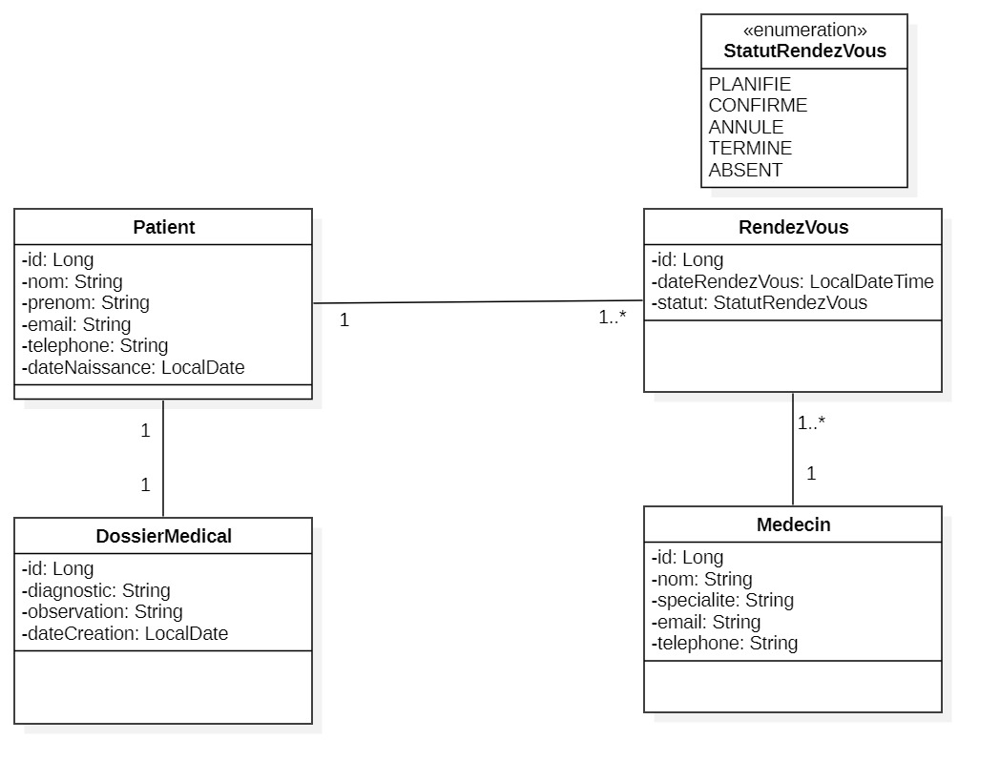
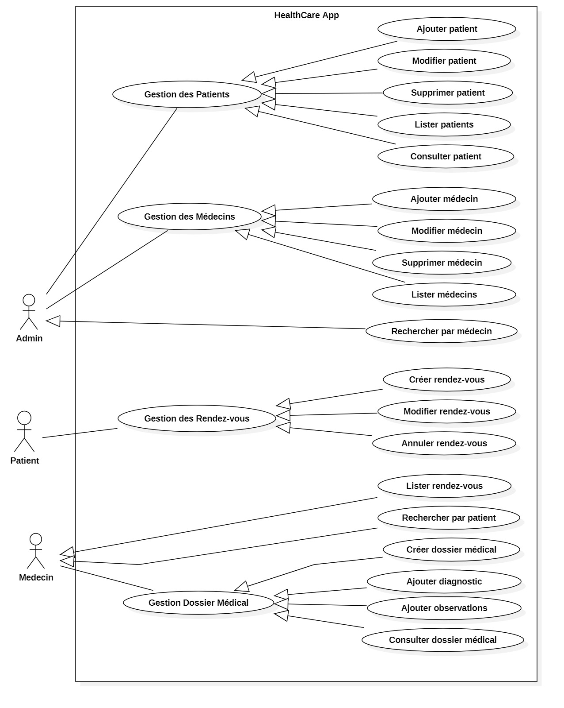
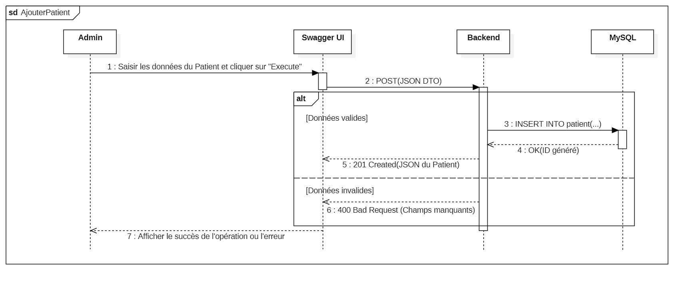
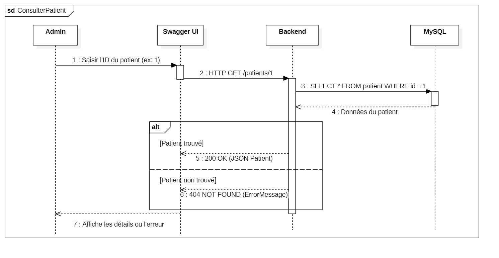
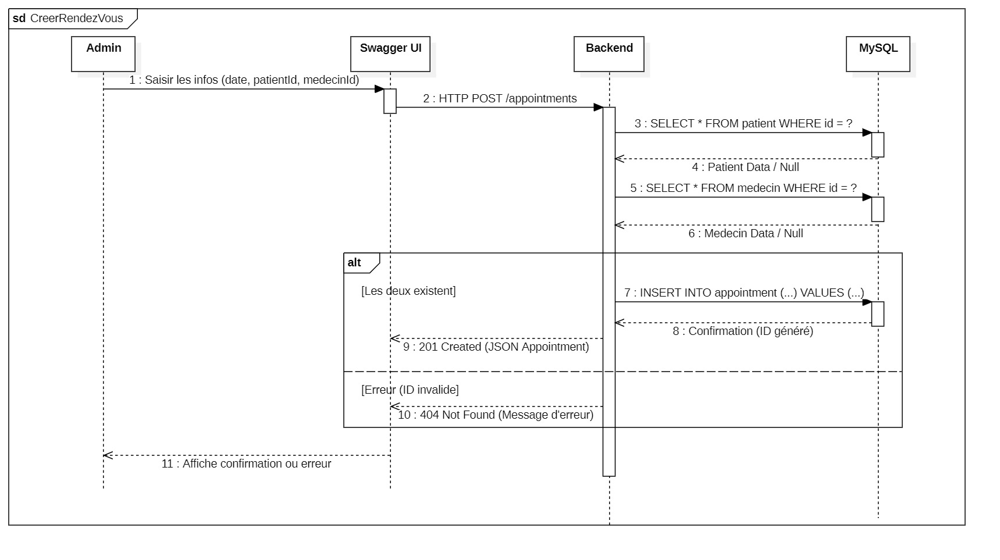

# HealthCare+ 
> API REST de gestion médicale développée avec Spring Boot


## Description
HealthCare+ est une application backend permettant de gérer les patients, les médecins, les rendez-vous et les dossiers médicaux d'un système de santé.


## Technologies utilisées
- **Java 17**
- **Spring Boot**
- **Spring Data JPA / Hibernate**
- **Flyway** (migrations BDD)
- **MySQL**
- **MapStruct** (DTO Mapper)
- **Swagger / OpenAPI** (documentation)
- **JUnit** (tests)
- **Docker**
- **Maven**


## Fonctionnalités
| Module          | Opérations |
|-----------------|-----------|
| Patient         | Ajouter, Modifier, Supprimer, Lister, Consulter |
| Médecin         | Ajouter, Modifier, Supprimer, Lister |
| Rendez-vous     | Créer, Modifier, Annuler, Lister, Rechercher par patient/médecin |
| Dossier Médical | Créer, Ajouter diagnostic, Ajouter observations, Consulter |


## Structure du projet
```
src/
├── main/
│   ├── java/com/healthcare/
│   │   ├── controller/
│   │   ├── dto/
│   │   ├── entity/
│   │   ├── exception/
│   │   ├── mapper/
│   │   └── repository/
│   │   └── service/
│   └── resources/
│       ├── application.properties
│       └── db/migration/
└── test/
```
## Diagrammes UML

### ==> Diagramme de Classe


### ==> Diagramme de cas d'utilisation


### ==>Diagrammes de séquence
### Ajouter Patient


### Consulter Patient


### Créer Rendez-vous



## Auteur
**Amal BASBAS** : Projet réalisé dans le cadre de la formation Développeuse  Web et Web Mobile