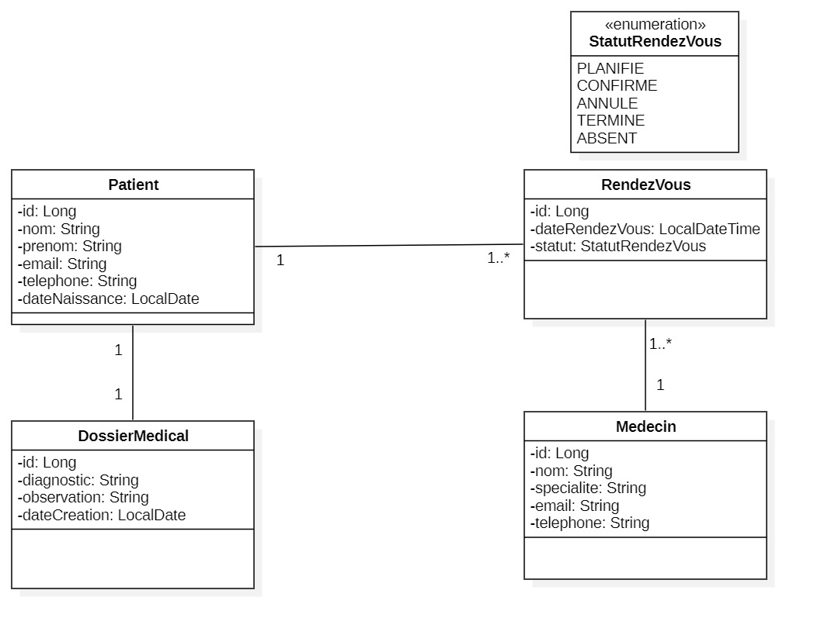
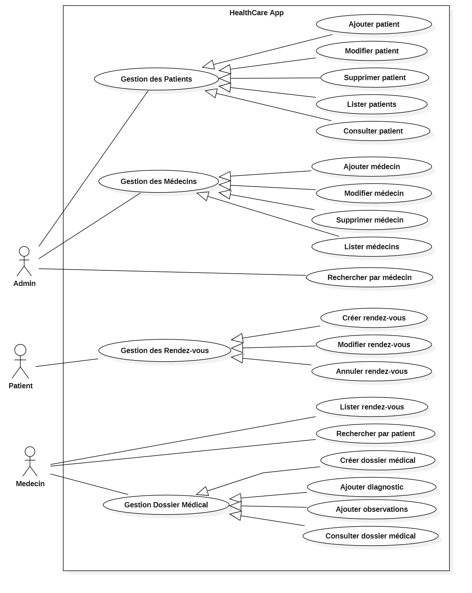
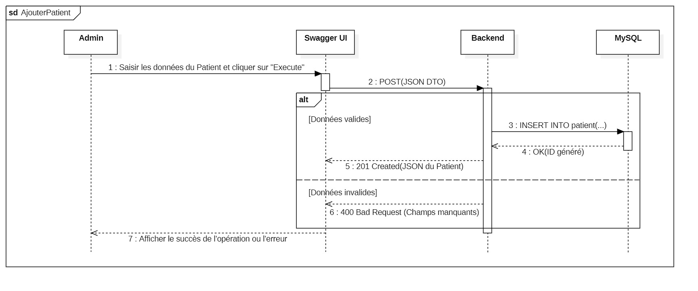
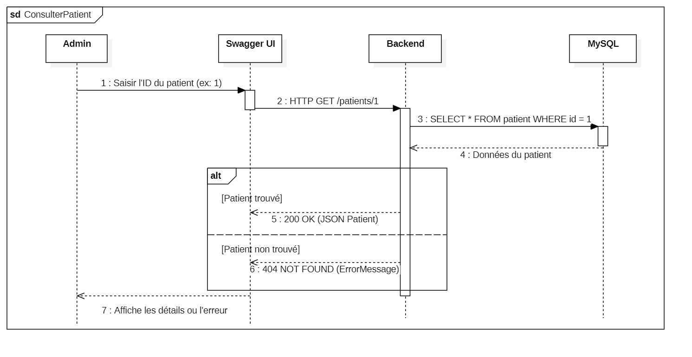
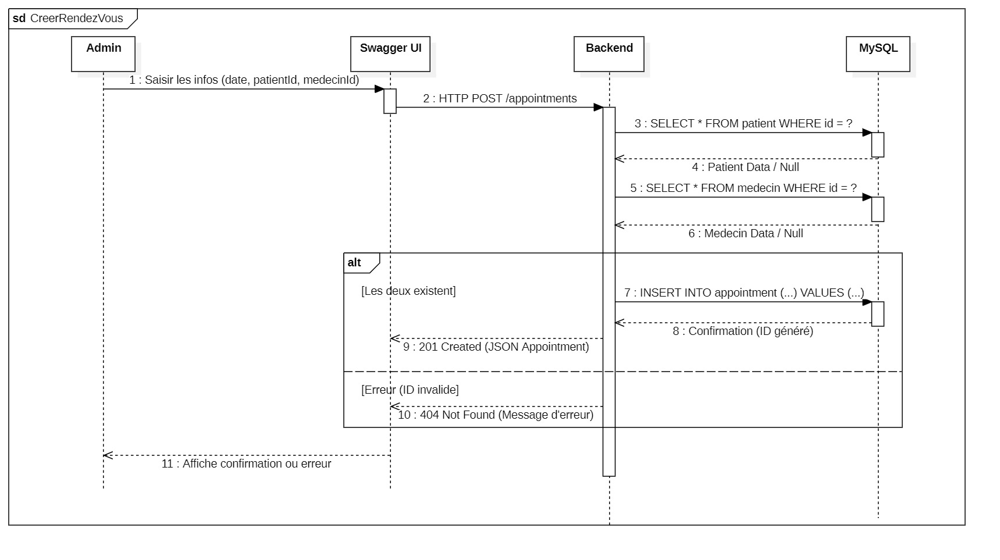

# HealthCare+ 
> API REST de gestion médicale développée avec Spring Boot


## Description
HealthCare+ est une application backend permettant de gérer les patients, les médecins, les rendez-vous et les dossiers médicaux d'un système de santé, tout en assurant la sécurité des données sensibles.


## Technologies utilisées
- **Java 17**
- **Spring Boot 3**
- **Spring Security 6** (JWT)
- **Spring Data JPA / Hibernate**
- **Flyway** (migrations BDD)
- **MySQL**
- **MapStruct** (DTO Mapper)
- **Swagger** (documentation)
- **JUnit** (tests)
- **Docker**
- **Maven**


## Fonctionnalités
| Module          | Opérations |
|-----------------|-----------|
| Patient         | Ajouter, Modifier, Supprimer, Lister, Consulter |
| Médecin         | Ajouter, Modifier, Supprimer, Lister |
| Rendez-vous     | Créer, Modifier, Annuler, Lister, Rechercher par patient/médecin |
| Dossier Médical | Créer, Ajouter diagnostic, Ajouter observations, Consulter |

## Nouvelles Fonctionnalités (v2)
- **Sécurité Avancée** : Authentification via **JWT** (JSON Web Token) avec Spring Security 6.
- **Gestion des Erreurs** : Centralisation des exceptions via un `GlobalExceptionHandler`.
- **Validation de Données** : Utilisation de Jakarta Validation sur les DTOs pour garantir l'intégrité des entrées.

## Structure du projet
```
src/
├── main/
│   ├── java/com/healthcare/
│   │   ├── config/          # Configuration Sécurité & JWT
│   │   ├── controller/      # AuthController, PatientController...
│   │   ├── dto/             # LoginRequest, AuthResponse, PatientDTO...
│   │   ├── entity/          # Entités JPA
│   │   ├── exception/       # GlobalExceptionHandler, Custom Exceptions
│   │   ├── mapper/          # Mappers MapStruct
│   │   ├── repository/      # Interfaces JpaRepository
│   │   └── service/         # Logique métier & AuthService
│   └── resources/
│       ├── application.properties
│       └── db/migration/    # Scripts Flyway (V1__init.sql...)
└── test/
```
## Partie 3 : Fonctionnalités Avancées 
### - Pagination et Tri
Pour garantir des performances optimales et une gestion fluide des données, toutes les entités principales (Patients, Médecins, Rendez-vous, Dossiers Médicaux) prennent en charge la **Pagination** côté serveur et le **Tri** calculé dynamiquement.
- Les points de terminaison (endpoints) acceptent des paramètres de page personnalisés (`page`, `size`) ainsi qu'un tri basé sur des critères spécifiques (`sortBy`, `direction`).
- Une architecture hautement évolutive (scalable), parfaitement adaptée à la gestion de volumes importants de données médicales.

## Diagrammes UML

### ==> Diagramme de Classe


### ==> Diagramme de cas d'utilisation


### ==>Diagrammes de séquence
### Ajouter Patient


### Consulter Patient


### Créer Rendez-vous



## Auteur
**Amal BASBAS** : Projet réalisé dans le cadre de la formation Développeuse  Web et Web Mobile